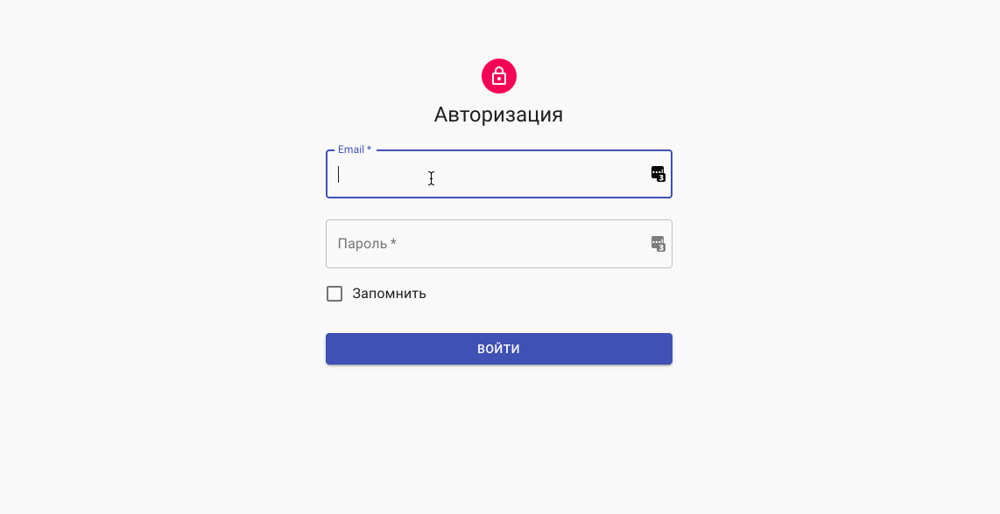

## Решение задания

Установка зависимостей
```
npm install
```

Запуск сервера
```
npm run server
```

Запуск приложения
```
npm run start
```

### Как это выглядит




## Задание

Сейчас в Teachbase мы занимаемся редизайном и переходом всей клиентской части на Реакт, поэтому задание будет связано с ним напрямую

Вам нужно будет сделать реальную страницу входа, разбив её на компоненты, добавить валидацию. Моковое API реализовно в этом репозитории.

#### Запуск мокового API

`yarn server`

`POST` в `http://localhost:3030/api/login` принимает объект

```json
{
  "login": "login",
  "password": "qwerty"
}
```

При наличии ошибок возвращает объект

```json
{
  "errors": ["Текст ошибки №1", "Текст ошибки №2"]
}
```

Если поле `password` содержит `'qwerty'`, вернется объет содержащий информацию о юзере

```json
{
  "data": {
    "id": 5,
    "name": "User name",
    "age": 25
  }
}
```

#### Требования к реализации

- ES6+ и `react` (v16)
- Webpack
- Typescript
- Для формы можно использовать `redux-form`, `final-form` или любую подобную библиотеку
- Валидация полей формы: `email` (обязательное), `password` (обязательное, длинна не меньше 6 символов)
- При отправке запроса можно показывать спиннер на кнопке
- В случае ошибки при входе показывать сообщение с выводом ошибок полученных из API
- При успешном логине показывать приветствие юзеру, с его именем (можно заюзать `alert`)
- Если останется время и желание, прикрутить `eslint`, тесты (`jest`) и i18n (`react-intl`)

Ниже скрин для того, чтобы примерно было понятно, на что ориентироваться. Дизайн можно менять на своё усмотрение:

